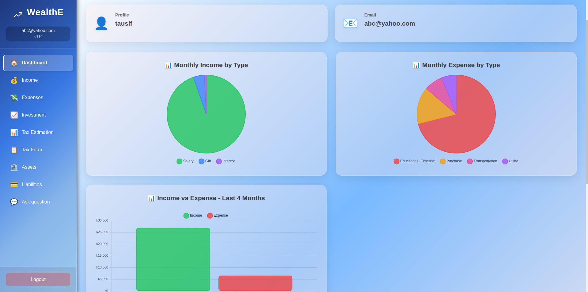
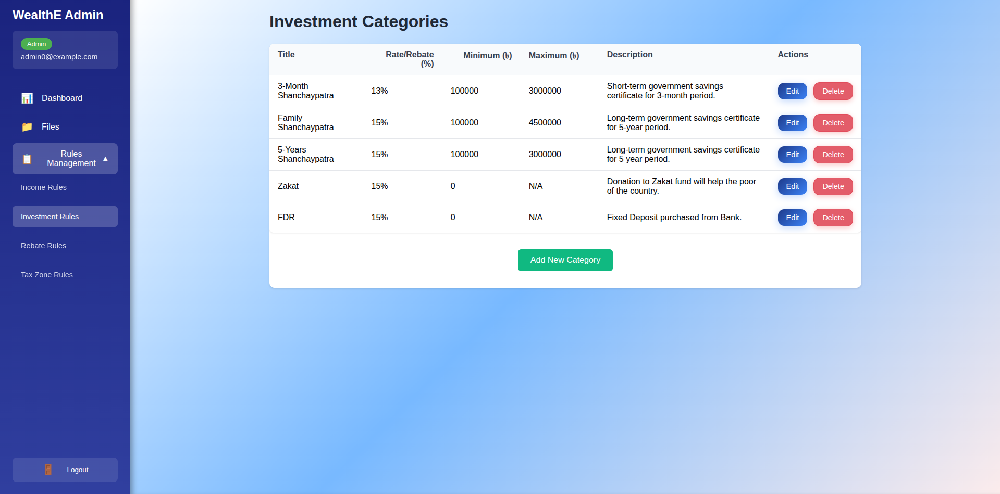
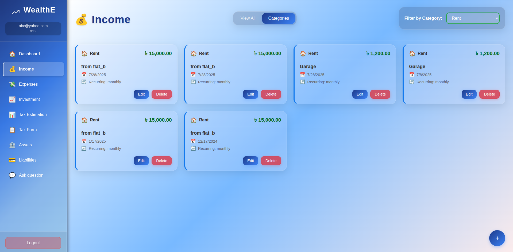
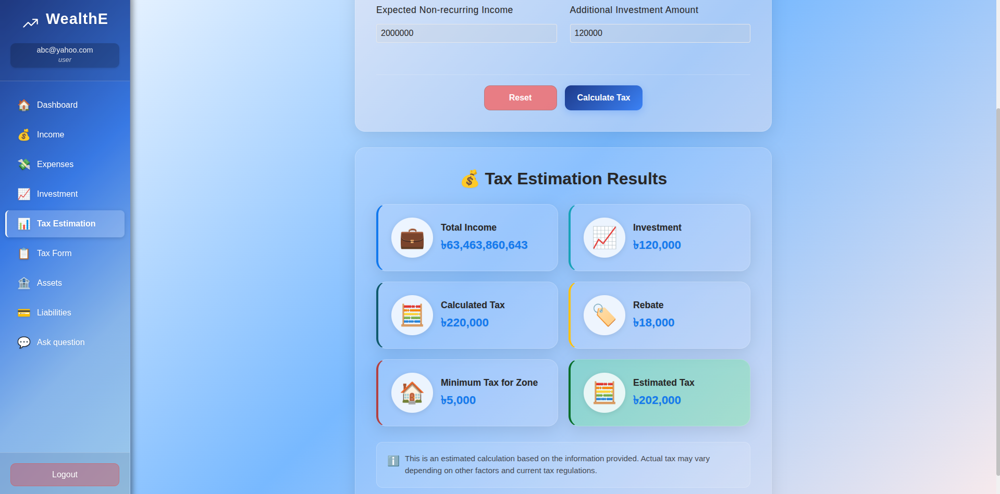
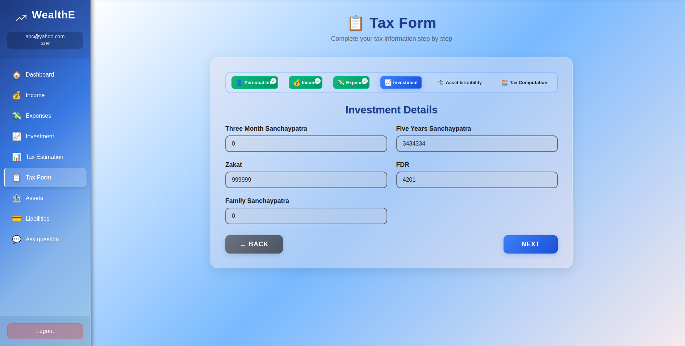
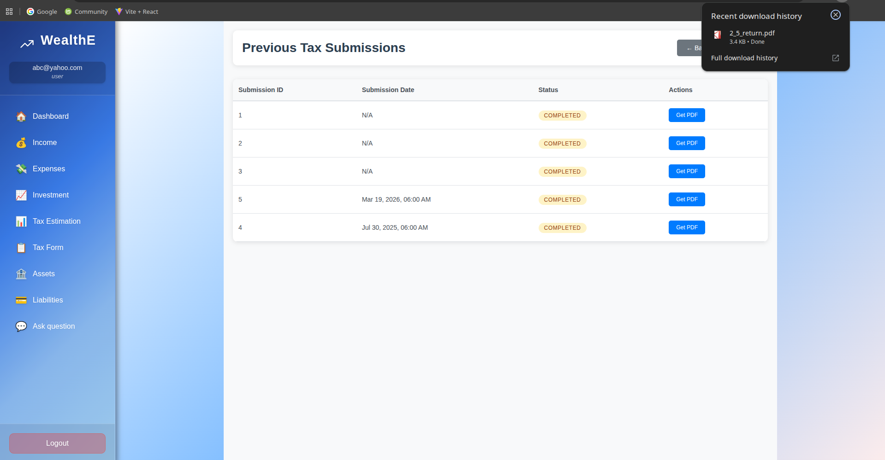
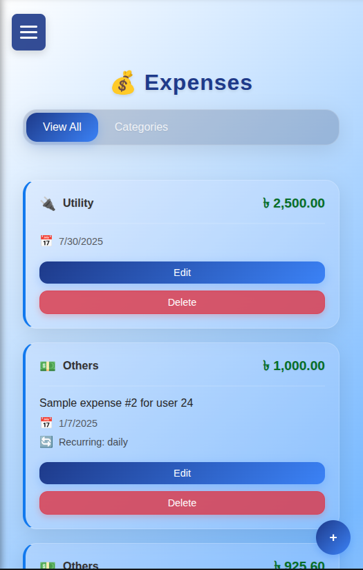

# <div align="center">WealthE💰</div>

<div align="center">
  <strong>Personal Finance Management System</strong><br>
  Link: http://152.42.167.4/
</div>

<div align="center">
  
  
  
  
  
</div>

### <div align="center"> Group 7 (A2) - CSE 408 Software Development Sessional </div>

<div align="center">
  <table>
    <tr>
      <td align="center">🎓 <strong>2005050</strong><br>Nabila Tabassum</td>
      <td align="center">🎓 <strong>2005052</strong><br>Tausif Rashid</td>
      <td align="center">🎓 <strong>2005056</strong><br>Azmal Karim</td>
    </tr>
  </table>
</div>

---

## Table of Contents

- [Overview](#overview)
- [Features](#features)
- [Architecture](#architecture)
- [Technology Stack](#technology-stack)
- [Installation & Setup](#installation--setup)
- [Screenshots](#screenshots)
- [Project Structure](#project-structure)


## Overview

**WealthE** is a personal finance management system designed to help users track their income, expenses, investments, assets, and liabilities. The application provides financial analytics, tax estimation, and tax return submission system.

## Features

### User Management
- **Secure Authentication**: JWT login and registration
- **Role-based Access**: Separate User and Admin permissions
- **Profile Management**: Edit profile info and password

### Financial Management
- **Income Tracking**: Record and categorize income
- **Expense Management**: Log and categorize expenses
- **Investment Portfolio**: Track stocks, bonds, and funds
- **Asset Management**: Manage property, vehicles, jewelry, and accounts
- **Liability Tracking**: Track loans and debts

### Tax Management
- **Tax Estimation**: Estimate payable tax
- **Tax Form Generation**: Generate and export tax forms
- **Tax Planning**: Plan upcoming tax dues

### Admin Features
- **Rule Management**: Configure income, investment, and rebate rules
- **Tax Zone Configuration**: Manage tax zones and circles
- **User Management**: Manage user accounts and activity

### 🤖 Additional Features
- **AI Chatbot**: Get quick finance guidance
- **Data Visualization**: Interactive Chart.js charts
- **Export Functionality**: Export data and reports
- **Responsive Design**: Works on desktop and mobile

## Architecture

WealthE follows a modern **three-tier architecture**:

1. **Frontend**: React.js SPA with responsive design
2. **Backend**: Spring Boot REST API with business logic
3. **Database**: PostgreSQL for reliable data persistence

### System Architecture Diagram
Detailed system architecture is available in `Software_architecture.pdf`

## Technology Stack

### Frontend
- **React 19.1**: Modern UI library
- **React Router 7.6**: Client-side routing
- **CSS3**: Modern styling with Flexbox/Grid

### Backend
- **Spring Boot 3.5**: Java-based backend framework
- **Spring Security**: Authentication and authorization
- **Spring Data JPA**: Database interaction
- **Maven**: Dependency management
- **Java 17**: Programming language

### Database
- **PostgreSQL 17**: Primary database
- **Flyway**: Database migration (if applicable)

### DevOps & Tools
- **Docker**: Containerization
- **Docker Compose**: Multi-container orchestration
- **Jest**: Frontend testing
- **Playwright**: End-to-end testing
- **Git**: Version control

## Installation & Setup

### Docker Setup (Recommended)

1. **Clone the repository**
   ```bash
   git clone https://github.com/Tausif-Rashid/WealthE-CSE408.git
   cd WealthE-CSE408
   ```

2. **Start the application with Docker, (make sure port 80 is free, stop nginx if running)**
   ```bash
   sudo docker-compose up -d
   ```

3. **Access the application**
   - Frontend: http://localhost:80
   - Backend API: http://localhost:8081
   - Database: localhost:5454

## Screenshots

<table>
  <tr>
    <td align="center">
      <a href="misc/SS/Dashboard.png">
        
      </a>
      <br>
      <strong>Dashboard</strong>
    </td>
    <td align="center">
      <a href="misc/SS/Admin.png">
        
      </a>
      <br>
      <strong>Admin Panel</strong>
    </td>
    <td align="center">
      <a href="misc/SS/IncomeCategory.png">
        
      </a>
      <br>
      <strong>Income Category Management</strong>
    </td>
  </tr>
  <tr>
    <td align="center">
      <a href="misc/SS/taxEstimation.png">
        
      </a>
      <br>
      <strong>Tax Estimation</strong>
    </td>
    <td align="center">
      <a href="misc/SS/TaxForm.png">
        
      </a>
      <br>
      <strong>Tax Form</strong>
    </td>
    <td align="center">
      <a href="misc/SS/GetTaxFormPDF.png">
        
      </a>
      <br>
      <strong>Tax Form PDF Generation</strong>
    </td>
  </tr>
  <tr>
    <td align="center">
      <a href="misc/SS/ResponsiveDesign.png">
        
      </a>
      <br>
      <strong>Responsive Design</strong>
    </td>
    <td></td>
    <td></td>
  </tr>
</table>

## Project Structure

```
WealthE-CSE408/
├── 📁 backend/
│   └── 📁 wealthe/                # Spring Boot application
│       ├── 📁 src/main/java/      # Java source code
│       ├── 📁 src/main/resources/ # Configuration files
│       └── 📄 pom.xml             # Maven dependencies
├── 📁 frontend/
│   └── 📁 wealthe-frontend/       # React application
│       ├── 📁 src/                # React source code
│       ├── 📁 public/             # Static assets
│       └── 📄 package.json        # NPM dependencies
├── 📁 e2e/                       # End-to-end tests
├── 📁 db/                        # Database backups
├── 📁 misc/                      # Miscellaneous files
├── 📄 docker-compose.yml          # Docker configuration
├── 📄 API_Documentation.md        # Detailed API docs
├── 📄 Software_architecture.pdf   # System architecture
└── 📄 README.md                   # This file
```
